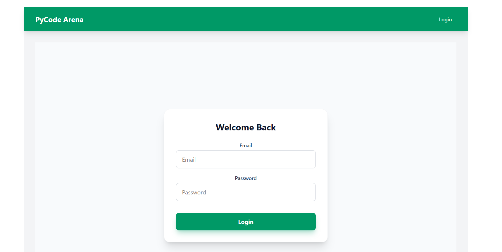
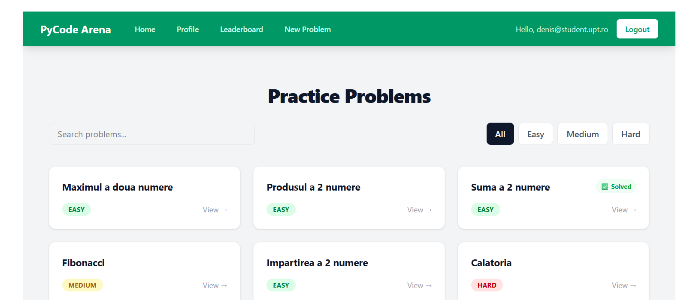
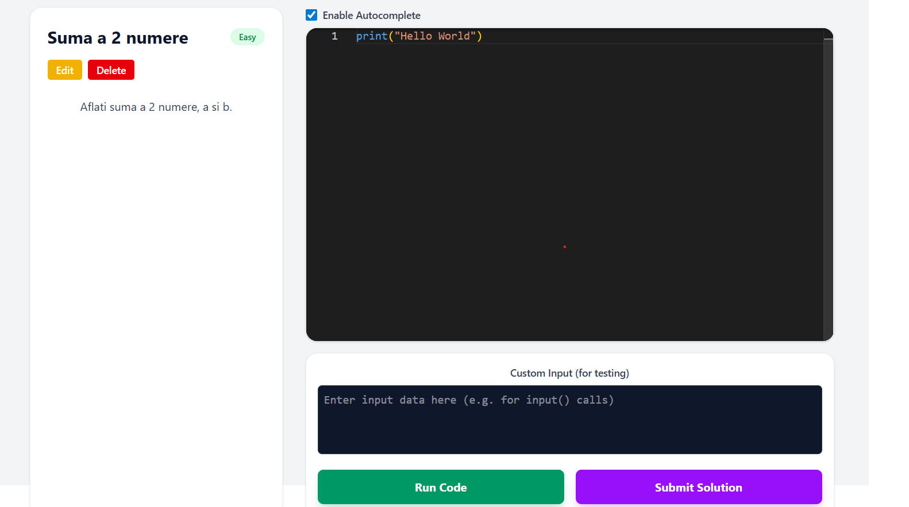
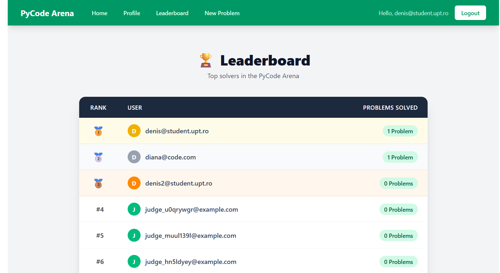
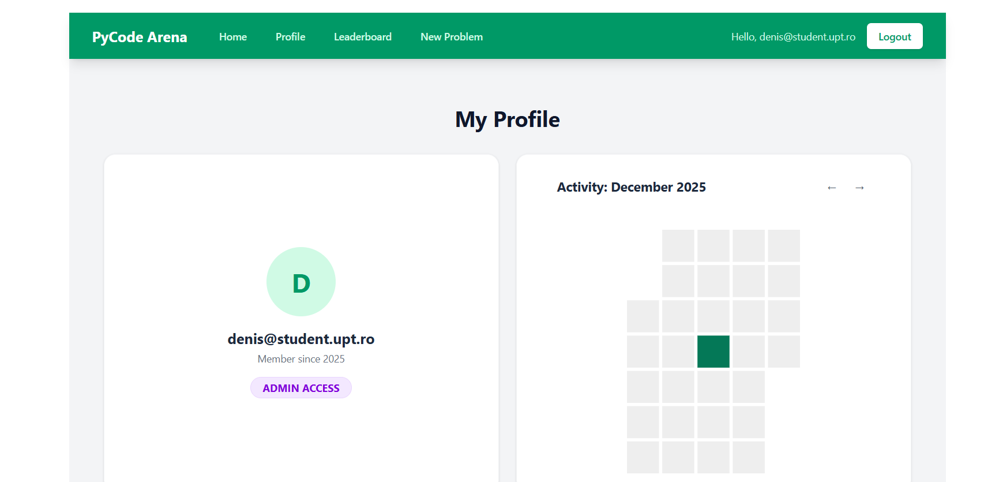
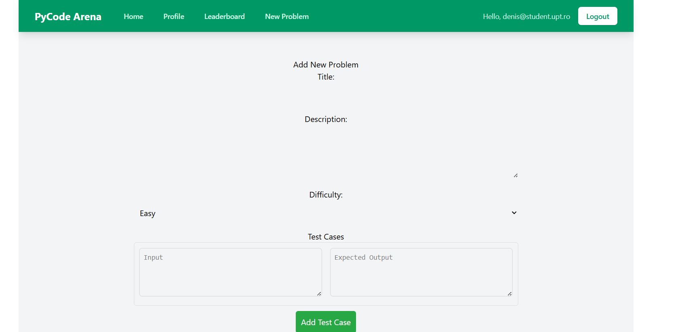

# 🏆 PyCode Arena


**PyCode Arena** este o platformă modernă de tip *Competitive Programming*, care permite utilizatorilor să rezolve probleme de algoritmică, să scrie cod într-un editor avansat și să primească feedback instantaneu, totul într-un mediu securizat și izolat.

Proiectul este construit ca o aplicație **Full-Stack Cloud Native**, complet containerizată folosind Docker.

---

## ✨ Funcționalități Cheie

* **🔐 Autentificare Securizată:** Sistem complet de Login/Register folosind **JWT (JSON Web Tokens)** și hashing de parole cu **Argon2** (standard industrial).
* **💻 Editor de Cod Avansat:** Integrare cu **Monaco Editor** (motorul din spatele VS Code) pentru syntax highlighting și autocomplete inteligent.
* **⚡ Execuție Rapidă:** Backend performant scris în **FastAPI** (Python).
* **🤖 AI Assistant:** Integrare cu **Google Gemini AI** pentru a oferi indicii și explicații inteligente studenților.
* **🐳 Dockerized:** Întreaga aplicație (Frontend, Backend, Bază de date) rulează în containere izolate, garantând compatibilitate 100% pe orice sistem de operare.
* **🎨 UI Modern:** Interfață reactivă construită cu **React 18**, **Vite** și **TailwindCSS**.

---

## 🛠️ Tech Stack

### Backend
* **Language:** Python 3.10
* **Framework:** FastAPI
* **Database:** SQLite (SQLAlchemy ORM)
* **Security:** Passlib (Argon2), Python-Jose (JWT)
* **AI:** Google Generative AI (Gemini)

### Frontend
* **Framework:** React 18
* **Build Tool:** Vite
* **Styling:** TailwindCSS
* **Editor:** @monaco-editor/react
* **HTTP Client:** Axios

### DevOps & Infrastructure
* **Containerization:** Docker & Docker Compose
* **Environment:** Linux (via Docker containers)

---

## 🚀 Cum să rulezi proiectul (Quick Start)

Deoarece proiectul este containerizat, nu ai nevoie să instalezi Python sau Node.js pe calculatorul tău. Ai nevoie doar de **Docker Desktop**.

### 1. Clonează repository-ul
```bash
git clone https://github.com/DenisRadu08/PyCodeArena.git
cd PyCodeArena
```

### 2. Configurare
Proiectul folosește variabile de mediu configurate deja în `docker-compose.yml` pentru dezvoltare locală. Asigură-te că fișierul `requirements.txt` conține dependențele necesare (inclusiv `argon2-cffi` și `google-generativeai`).

### 3. Pornește aplicația
Rulează o singură comandă în terminalul din folderul proiectului:

```bash
docker-compose up --build
```

Așteaptă câteva minute până când Docker descarcă imaginile și instalează dependențele. Când vezi mesajul `Uvicorn running on http://0.0.0.0:8000`, ești gata!

### 4. Acces
* **Frontend (Aplicația):** [http://localhost:5173](http://localhost:5173)
* **Backend (API Docs):** [http://localhost:8000/docs](http://localhost:8000/docs)

---

## 🔮 Roadmap (Planuri de viitor)

- [ ] **User Profiles:** Statistici detaliate și grafice de activitate (Heatmap).
- [ ] **Judge System:** Limite de timp (Time Limit) și memorie pentru execuția codului.
- [ ] **Gamification:** Sistem de medalii și ranguri.
- [ ] **Multi-language:** Suport pentru C++ și Java.

---

## 📸 Screenshots

### 🔐 Login & Autentificare


---

### 📋 Dashboard & Lista de Probleme


---

### 💻 Editorul de Cod (IDE)


---

### 🏆 Leaderboard


---

### 👤 Profil Utilizator


---

### ➕ Adăugare Problemă (Admin)


---

Made by Denis Radu
